# Z: Employee Management System

## Table of Contents

- [Description](#description)
- [Tech Stack](#tech-stack)
- [Installation](#installation)
- [Usage](#Usage)
- [Contributions](#contributions)

## [Description](#table-of-contents)

- Z is a company with 40 full-time employees and will triple their workforce within the next 18 months. We have provided them a new employee management system that will help them maintain their employee data.

## [Tech Stack](#table-of-contents)

- **Java**
  - Core language to develop all server-side logic
- **Maven**
  - Used to handle compilation, dependencies, and testing
- **Javalin**
  - HTTP microframework to define RESTful endpoints and integrates with Jackson to extract JSON
- **JDBC**
  - Allows direct access to MySQL database employeeData
- **JSON Web Token**
  - Used to issue token upon successful login then then token is used to check "role" (admin vs. employee)
- **Node.js**
  - Middleware between client and Java API
- **Axios**
  - Handles HTTP requests from React to Node.js and from Node.js to Java
- **Express**
  - Handles routing to Java API
- **React**
  - UI library to dynamically rendering login page, dashboard, forms, and tables
- **React-Router**
  - Used for client-side routing
- **React Bootstrap**
  - Used to style components and provide a consistent layout

## [Installation](#table-of-contents)

- **Node.js must be installed to run "npm install"**
- git clone the repository
- "npm i" is required at root, client, and server (node) to install all dependencies

- For client:

  - cd client
  - npm i

- For server (node):
  - cd server
  - npm i

## [Usage](#table-of-contents)

- After all dependencies have been installed, run "npm start" at the root to concurrently run client, server, and java

### **LOGIN PAGE**

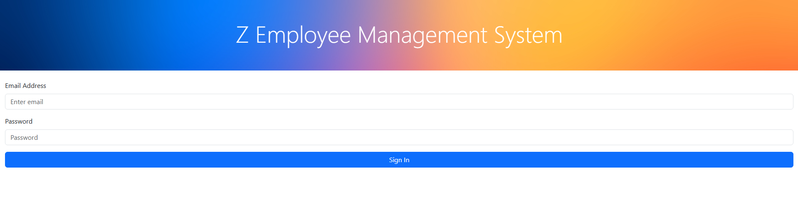

### **ADMIN**

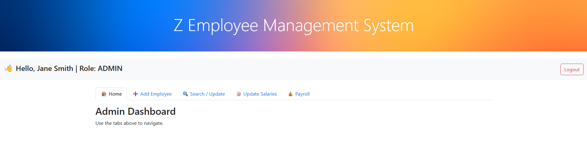

- Dashboard logged in as an "admin"

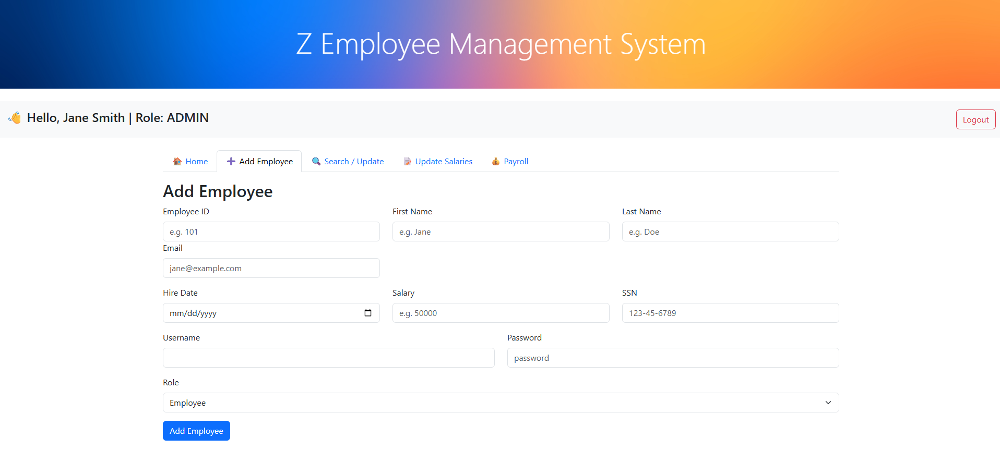

- Form to add an employee as an "admin"

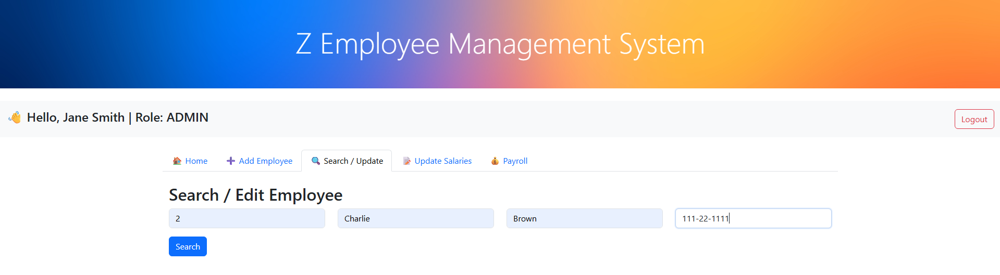

- Admin is able to read employee all employees' data
- Form to search for an employee as an "admin"

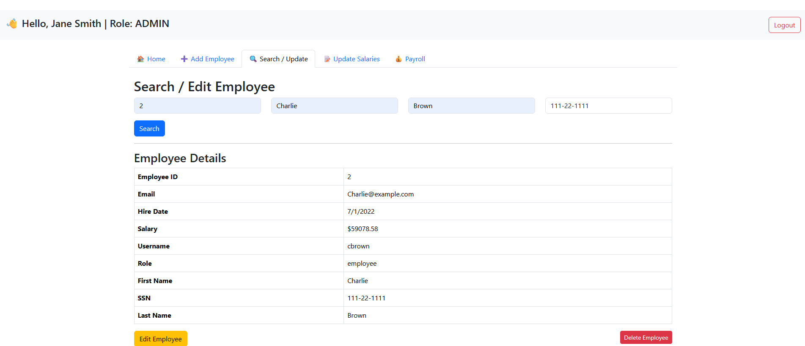

- Admin is able to update or delete an employee
- Returned table of pseudo-employee data from database with buttons to update/delete employee

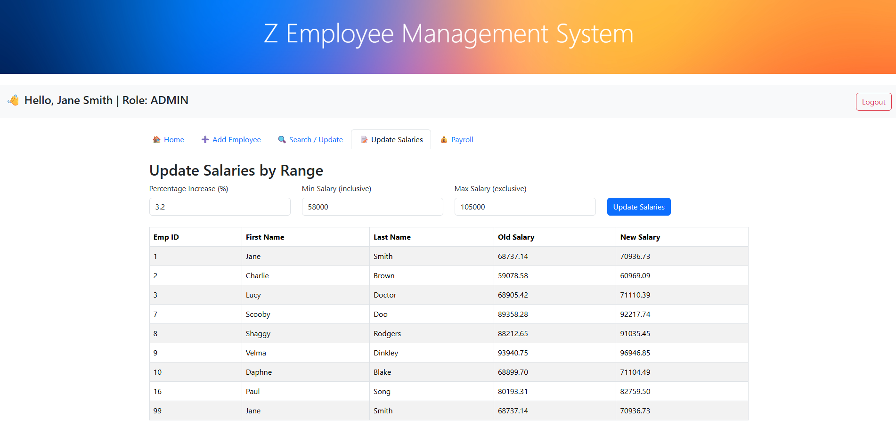

- Admin is able to update all employees' salary by a percentage within a specific range
- Form to update salary by percentage within the salary range
- Table is returned with employee data of those that were updated

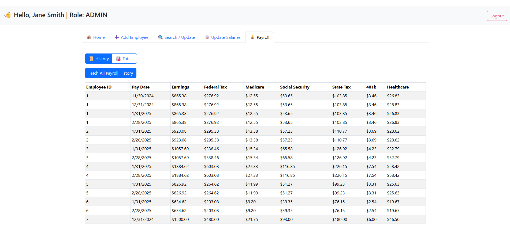

- Admin is able to read all payroll data in the database
- Table is returned with all payroll data when admin wanted to read all payroll history
- Sorted by employee ID then pay date

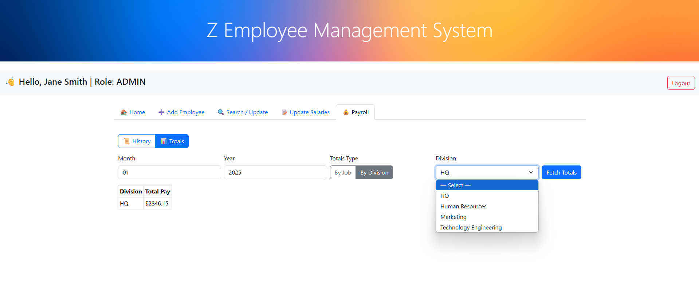

- Admin is able to read total pay by month/year by division

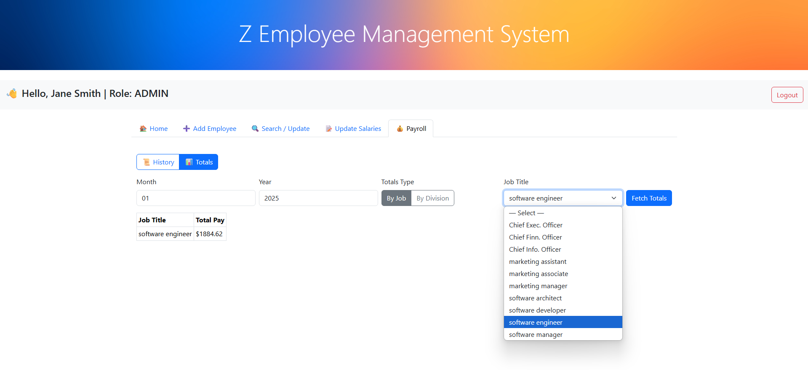

- Admin is able to read total pay by month/year by job title

### **EMPLOYEE**

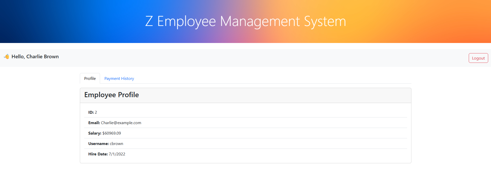
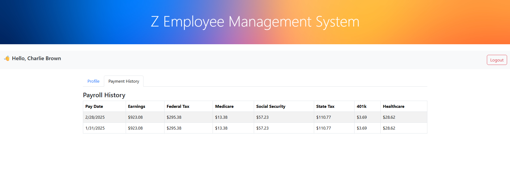

- Employee is only able to read their data once logged in

## [Contributions](#table-of-contents)

- Paul Song (https://github.com/psong1)
- Jorge Morgin-Minero (https://github.com/JaMM916)
- Sergio Valdez (https://github.com/svaldez0202)
- Jason Lopez (https://github.com/Jsiinn)
